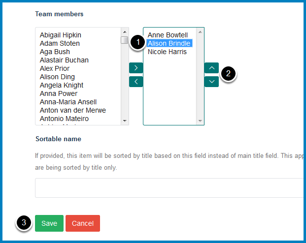

Change the Order of Team Members
================================

This shows you how to change the order of team members in the **Our Team** section of your team page.

Edit team page
--------------

Go to your team page and click **Edit**.

Reorder team member
-------------------

To change the order of a team member:

#. Select the name of the person you would like to reorder.
#. Use the up and down arrows to move them to the required position. 
#. Click the **Save** button.

Further Information
-------------------

* :doc:`Add a Team Member <add-a-team-member>`
* :doc:`Remove a Team Member <remove-a-team-member>`

If you are listing Profiles in a Column please see: 

* :doc:`Remove Profiles from a Column Listing Profiles <remove-profiles-from-a-column-listing-profiles>`
* :doc:`Add a Profile to a Column Listing Profiles <add-a-profile-to-a-column-listing-profiles>`
* :doc:`Change the Order of Profiles in a Column Listing Profiles <change-the-order-of-profiles-in-a-profiles-listing-column>`