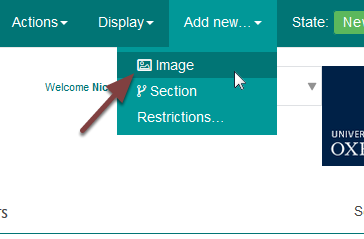
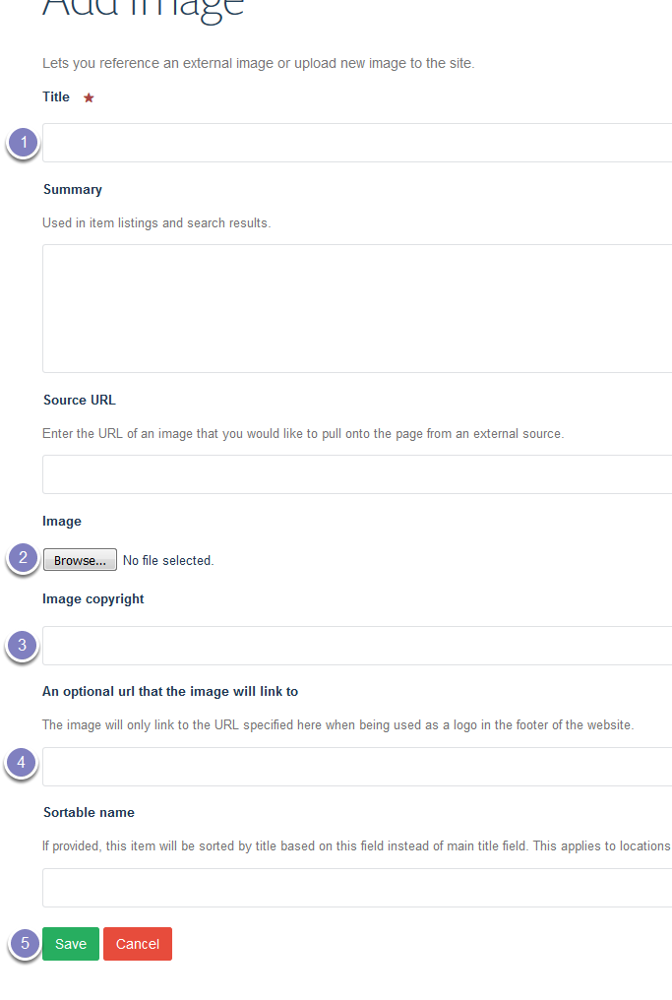
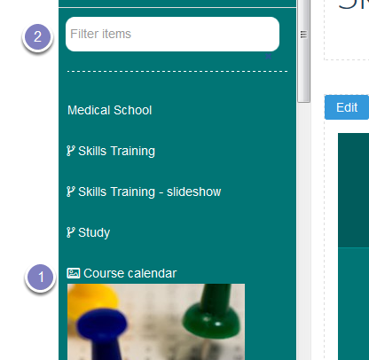
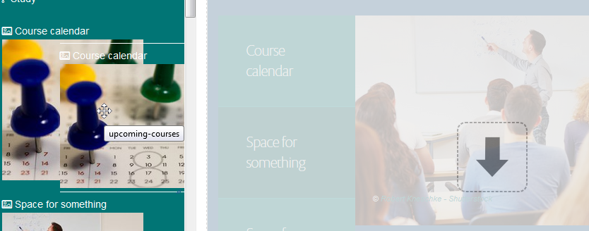
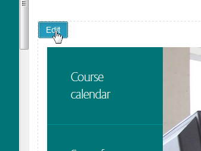
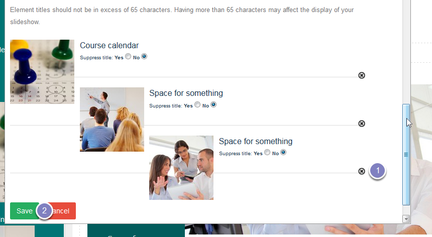

Change the Slide on the Homepage
================================

Images for the slideshow on the Skills Training Homepage are stored at: `https://www.medsci.ox.ac.uk/images/study/skills-training-slideshow <https://www.medsci.ox.ac.uk/images/study/skills-training-slideshow>`_ 

This shows you how to add a new slide to the slideshow. You need to upload the image first and then pull it onto the slideshow. 

Upload image
------------

Go to the images section for the Skills Training slideshow. 

To add a new image click **Add new...** from the toolbar at the top of the screen and select **Image**.

Enter the following information:

#. Title - this forms the text on your slide.
#. Click **Browse** and upload the image from your computer. The image should be 760px x 389px. The slideshow currently crops the bottom of the images slightly. 
#. Enter copyright information.
#. Enter the web address of the page you would like the slide to link to. 
#. Click **Save**. 

Add slide to the homepage
-------------------------

Go to your homepage and click **Compose** on the toolbar at the top of the page. 

Find the slide you just created. You can find it:

#. In the list of recent items if you have just uploaded it.
#. By searching for the item by the title in the search box.

Select the image and drag it across to the slideshow.  

Delete a slide
--------------

You will need to delete one of the existing slides as you can only have three slides on the slideshow.

Hovering over the slideshow will bring up an **Edit** button in the top left corner. Click this button to open an editing window:

#. Scroll to the bottom of the window and click  the x next to the slide you would like to delete. 
#. Click Save.