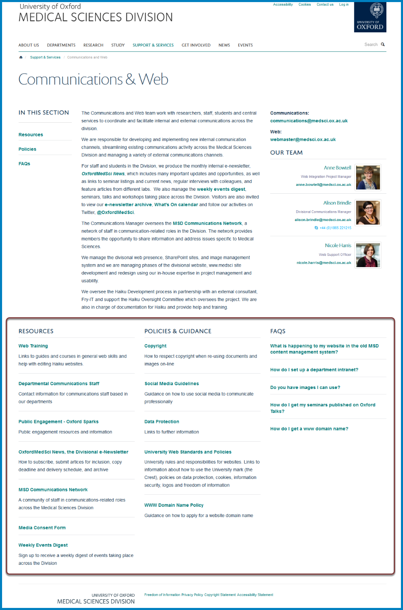

Columns of Further Information
==============================

Columns enable you to add additional information to your team pages. 

There are three type of columns:

#. **Content column** where content is created in the column - eg webpages, links to internal or external website and documents. 
#. **List of items column** where content is pulled in from other parts of the MSD website - eg a list of profiles or news items.   
#. **FAQs column** 

If you would like a new column set up please email webmaster@medsci.ox.ac.uk

Screenshot showing columns on a team page
-----------------------------------------

More information
----------------

**All columns**

* :doc:`Change a Column Title <change-a-column-title>`

**Content column**

* :doc:`Add a New Column <add-a-new-column>`
* :doc:`Edit a Column Page <edit-a-column-page>`
* :doc:`Add a Column Page <add-a-column-page>`
* :doc:`Add a Link to a Column <add-a-link-to-a-column>`
* :doc:`Add a Document to a Column <add-a-document-to-a-column>`

**List of items columns:**

* :doc:`Add an Item to a List of Items Column <add-an-item-to-a-list-of-items-column>`
* :doc:`Remove an Item from a List of Items Column <remove-an-item-from-a-list-of-items-column>`

**Profile columns (currently used on the Medical School team page):**

* :doc:`Remove Profiles from a Column Listing Profiles <remove-profiles-from-a-column-listing-profiles>`
* :doc:`Add a Profile to a Column Listing Profiles <add-a-profile-to-a-column-listing-profiles>`
* :doc:`Change the Order of Profiles in a Column Listing Profiles <change-the-order-of-profiles-in-a-column-listing-profiles>`

**FAQs**

* :doc:`Create a FAQs section <create-a-faqs-section>`
* :doc:`Edit a FAQ <edit-a-faq>`
* :doc:`Add a FAQ <add-a-faq>`
* :doc:`Change the Display Order of FAQs <change-the-display-order-of-faqs>`
* :doc:`Set the number of FAQs on display on your team page <set-the-number-of-faqs-on-display-on-your-team-page>`

