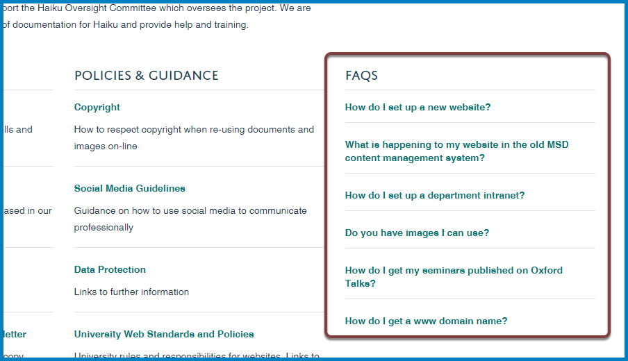

Create a FAQs Section
=====================

You can have a set of FAQs in the columns of further information at the bottom of your team pages:

FAQs give you an effective way to:

#. Provide answers to questions which you are asked over and over again. 
#. Flag up information on other websites eg the main University site.

If you would like an FAQs section added to your team page email webmaster@medsci.ox.ac.uk

Further Information
-------------------

* :doc:`Create a FAQs section <create-a-faqs-section>`
* :doc:`Edit a FAQ <edit-a-faq>`
* :doc:`Add a FAQ <add-a-faq>`
* :doc:`Change the Display Order of FAQs <change-the-display-order-of-faqs>`
* :doc:`Set the number of FAQs on display on your team page <set-the-number-of-faqs-on-display-on-your-team-page>`