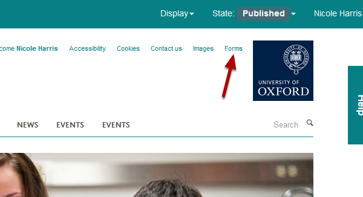
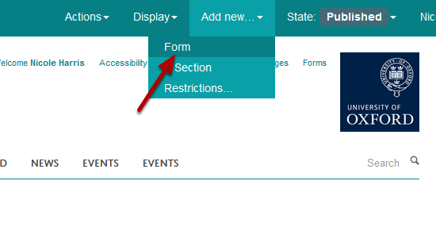
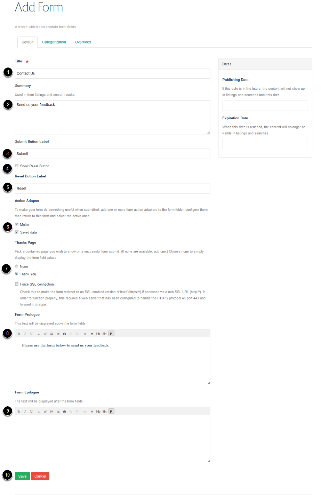
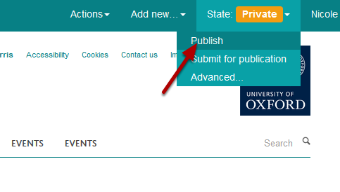
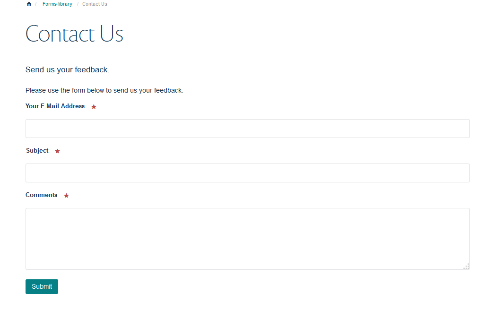

Create a Form
=============

This provides you with an overview of how to create a form. 

See also:

Form Data, Add a Field to a Form, Change the Order of Fields, Edit a Form Thank You Page. 

Forms library
-------------

Click on the **Forms** link next to the University logo. If you can't see the Forms link contact your Editor-in-Chief for access.

Click on **Add new...** and select **Form**. 

Enter form details:

1. Form title.

2. Summary of the form.

3. Text on button to submit the form.

4. Select if you would like a reset button.

5. Text on reset button.

6. Options to email / save data - see the **Forms Data** guide for more details. 

7. Select if you would like to include a thank you for submitting the form page. You can edit this thank you page - see the **Edit a Form Thank You Page** guide for details. 

8. This text displays before the form fields.

9. Text entered here displays after the form fields. 

10. Save your form.

Publish form
------------

Click on **State** and select **Publish**.

Your form
---------

You can now add additional fields to the form. 

See the **Add Fields to a Form** guide for details. 

You can add a link to your form from the left hand navigation of the section you would like to add it to. See the **Links in Left Hand Navigation** guide for details. 