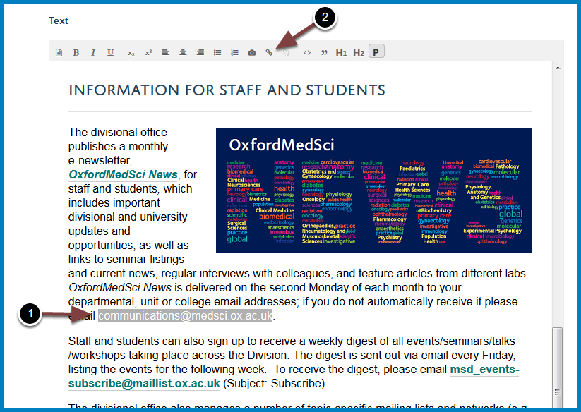

Create an Email Link
====================

You can add email links to the main text content area of a page. 

**Note:** not all visitors to your website will use email systems which support clickable email links. 

Edit page
---------

Go to the page you would like to add the email link to. 

Click **Edit**.

Create link
-----------

Scroll down to the text editing box.

#. Highlight the text you would like to turn into an email link.
#. Click the link creation icon.

Click the **Email** tab.

#. Enter the email address for the link.
#. If you enter text into the **Subject** field this will form the subject line of the email link. 
#. Click **OK**.

Save 
-----

Scroll to the bottom of the page and click the **Save** button.