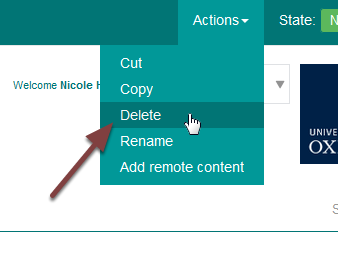
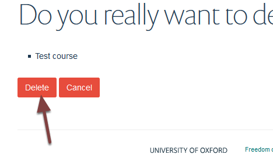

Delete a Course (MSD Graduate School)
=====================================

This shows you how to delete a course from the MSD Graduate School. You can also unpublish a course. 

Actions
-------

Go to the course page. 

Click **Actions** on the toolbar at the top of the page and select **Delete**. 

Delete course
-------------

Click delete

Further information
-------------------

* Unpublish a course (MSD Graduate School)