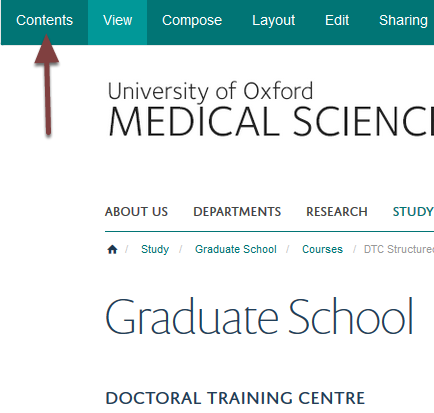
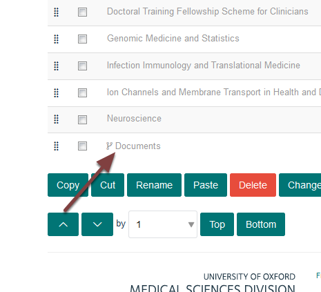
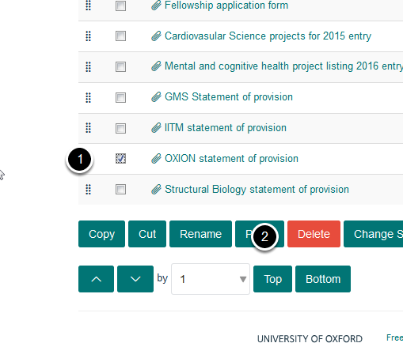
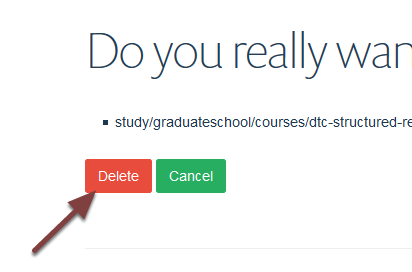

Delete a Document from the Doctoral Training Centre (MSD Graduate School)
=========================================================================

All old documents should be deleted - it isn't possible to unpublish documents and they will still be available to the public even if they aren't linked to from a page. 

Contents
--------

Go to the main Doctoral Training Centre page.

Click **Contents** on the tool bar at the top of the page. 

Documents
---------

Click the **Documents** link to go to the section where documents are uploaded.

Select document
---------------

#. Select the checkbox next to the document you would like to delete.
#. Click **Delete**.

Confirm deletion
----------------

Click **Delete**.