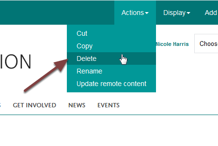

Delete a Supervisor (MSD Graduate School)
=========================================

This shows you how to delete a supervisor from the MSD Graduate School pages. You can also unpublish a profile rather than deleting. 

Actions
-------

Go to the supervisor's profile.

Click **Actions** on the toolbar at the top of the page and select **Delete**. 

Delete
------

Click the **Delete** button.

Further information
-------------------

:doc:`Unpublish a Supervisor <unpublish-a-supervisor>` (MSD Graduate School)