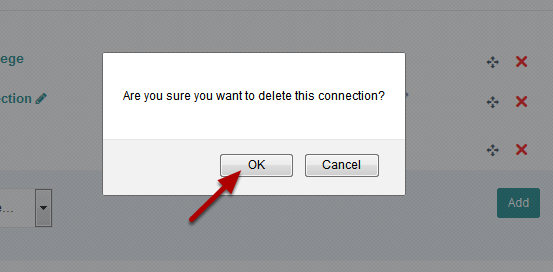
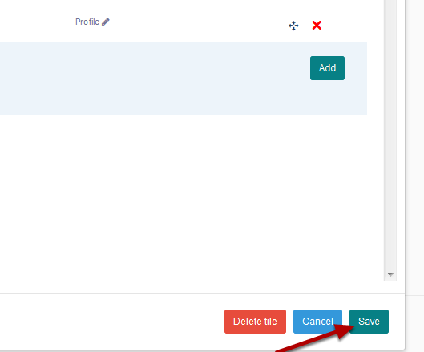

Delete Connections from your Profile
====================================

You can delete connections from your profile. You can either delete individual connections or the entire connections tile. 

Edit profile
------------

Click the **Edit my profile** button.

Edit Connections
----------------

To edit your connections click the **Edit** button on the top right hand side of your list of connections. The button will appear when you hover over the list of connections. 

Delete a connection
-------------------

To delete a connection click the red cross.

Click OK.

Save your changes
-----------------

Click the **Save** button.

Delete the Connections Tile
---------------------------

To delete the entire connections tile click **Delete tile**.

Click OK.

Save layout
-----------

Click the **Save layout** button at the top right hand side of the your profile. 