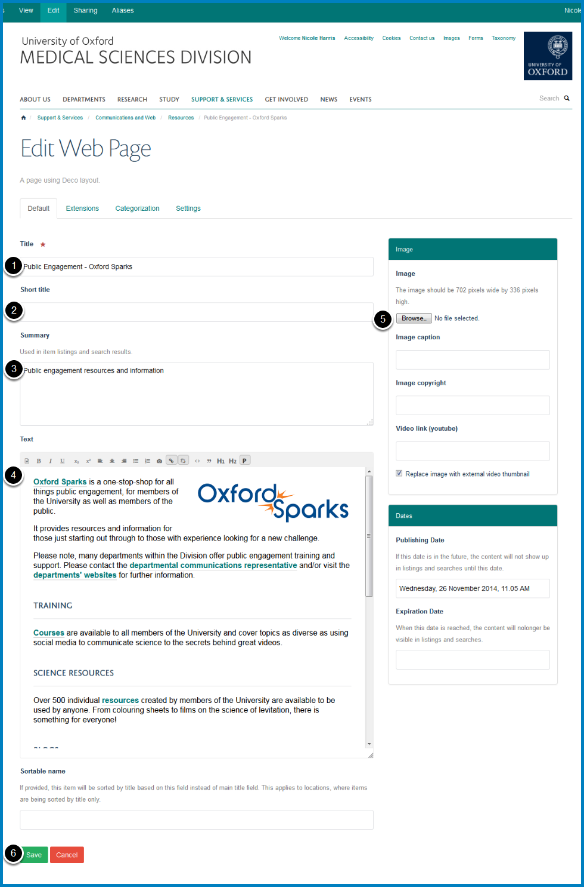

Edit a Column Page
==================

This shows you how to edit a page which is listed in one of the columns on your team page. 

Select page
-----------

.. image:: images/edit-a-column-page/select-page.png
   :alt: 
   :height: 483px
   :width: 808px
   :align: center

Click the title of the page you would like to edit. 

Edit
----

.. image:: images/edit-a-column-page/edit.png
   :alt: 
   :height: 434px
   :width: 620px
   :align: center

Click **Edit** on the toolbar at the top of the page.

#. Title
#. Short title
#. Summary
#. Main content 
#. Image - banner style image across the top of the page (see ...... for full details of this)
#. Click **Save**

