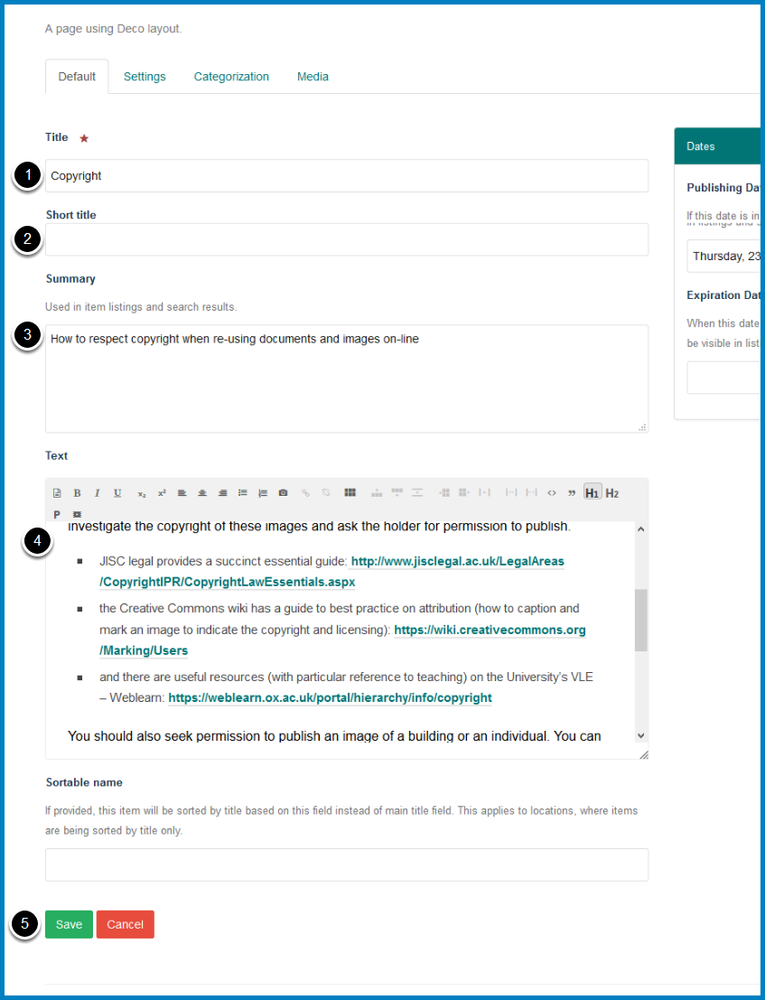

Edit a Column Page
==================

This shows you how to edit a page from one of the columns on your team page. 

Select page
-----------

.. image:: images/edit-a-column-page/select-page.png
   :alt: 
   :height: 483px
   :width: 808px
   :align: center

Click the title of the page you would like to edit to open the page.

Edit
----

.. image:: images/edit-a-column-page/edit.png
   :alt: 
   :height: 434px
   :width: 620px
   :align: center

Click **Edit** on the toolbar at the top of the page.

Make changes
------------

#. Page title - it is best to keep these short. 
#. Short title - with the current set up of the columns this is only relevant when setting up a new page. 
#. Page summary - this forms the first paragraph of your page and displays in a slightly larger font than the rest of the page. It will also display in the column under the page title and in search results. Adding a summary helps users assess whether this is the information they are looking for. 
#. Edit the main content of your page. 
#. Click the **Save** button

Further information
-------------------

* :doc:`Create an Internal Link <Create_an_Internal_Link>`
* :doc:`Create a Link to an External Website <Create_a_Link_to_an_External_Website>`
* :doc:`Create an Email Link <create-an-email-link>` 
* :doc:`Add an Image to a Column Page <add-an-image-to-a-column-page>`