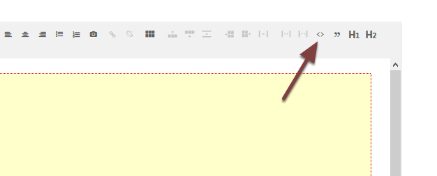

Edit a Course iframe  - change the height of the iframe and / or remove the booking link (Skill training website)
=================================================================================================================

This shows you how to edit an existing iframe on a skill training course page. You can remove the booking link and change the height of the iframe. 

Course page
-----------

Go to the course page and click **Edit** on the toolbar at the top of the screen. 

HTML view
---------

Click the **< >** icon to bring up the HTML view:

Update iframe
-------------

#. To change the height of the iframe change the number of the height. Try increasing or decreasing by 100 initially. 
#. To remove the course link remove the text **bookable=True** .
#. Click the **Update** button. 

Save your changes
-----------------

Scroll to the bottom of the page and click **Save**. 