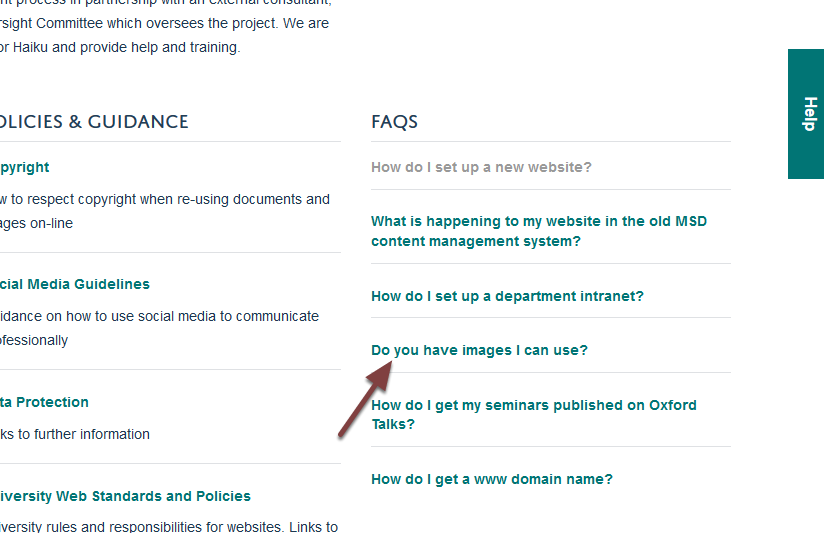
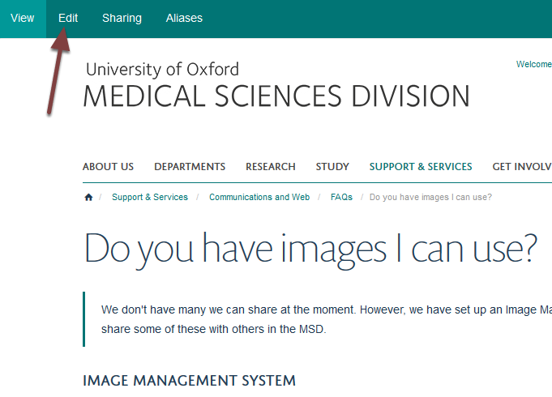

Edit a FAQ
==========

This shows you how to edit a FAQ. 

Select FAQ
----------

Select the FAQ you would like to edit. 

Edit FAQ
--------

Click **Edit** on the toolbar at the top of the screen. 

Make your changes
-----------------

#. Question Title
#. Short Answer - The short answer will display on the FAQ page, the :doc:`FAQ listing page <faqs-short-answer>` and on :doc:`search results <faqs-short-answer>`. Entering a short answer will help people know whether the FAQ is what they are looking for. 
#. Answer
#. Click **Save**

Further information
-------------------

* :doc:`Create a FAQs section <create-a-faqs-section>`
* :doc:`Add a FAQ <add-a-faq>`
* :doc:`Change the Display Order of FAQs <change-the-display-order-of-faqs>`
* :doc:`Set the number of FAQs on display on your team page <set-the-number-of-faqs-on-display-on-your-team-page>`