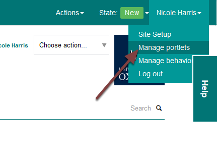
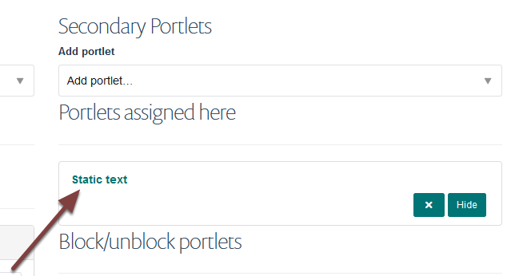
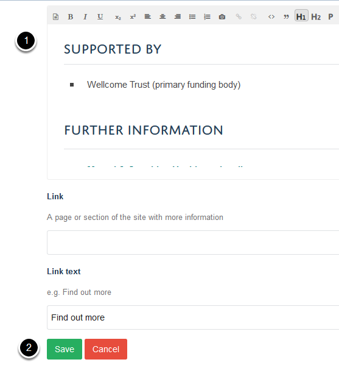

Edit a Portlet on a Course Page (MSD Graduate School)
=====================================================

Portlets provide links to futher information on course pages. These are located on the left hand side of the page. 

Manage portlets
---------------

Go to the course page.

Click on your name and select **Manage portlets** from the drop down list. 

Static text portlet
-------------------

Click on **Static text**.

Edit portlet
------------

#. Make your changes.
#. Click **Save**.