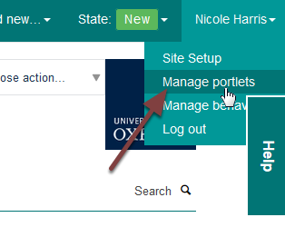
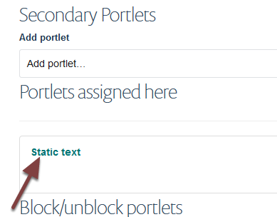
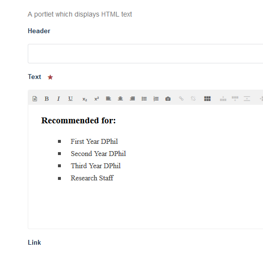
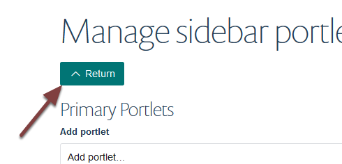

Edit a Right Hand Portlet
=========================

This show you how to edit a portlet on the right side of a courses page.

Manage portlets
---------------

Click your name on the toolbar at the top of the page and select **Manage portlets**. 

Edit portlet
------------

The portlets on the right of the page are listed under secondary portlets. 

Click the link to bring up the editing interface:

Make your changes. Scroll to the bottom of the page and click the **Save** button. 

Click **Return** to go back to your page.