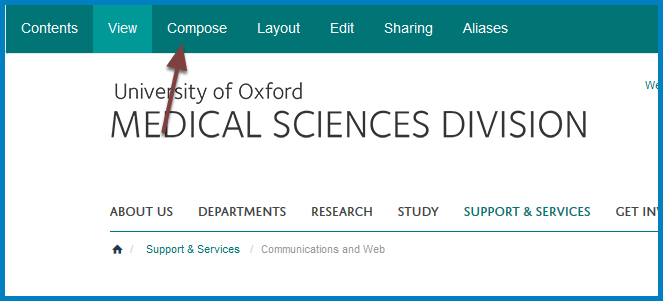
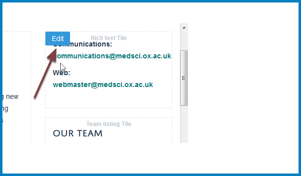
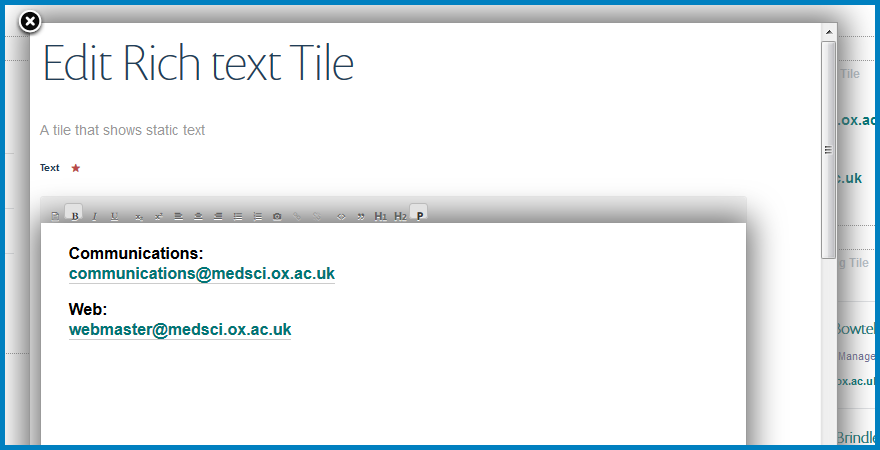
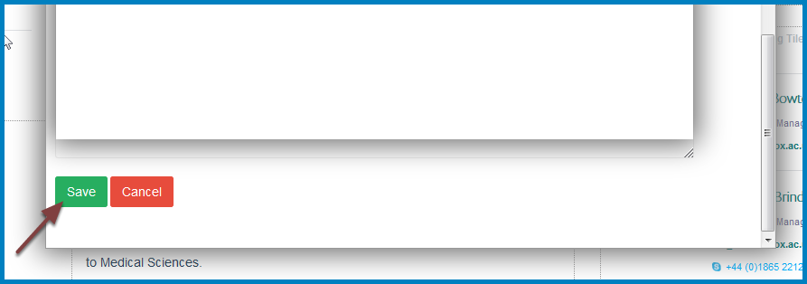

Edit Contact Details
====================

This shows you how to edit the contact details on your team page.

Edit team page
--------------

Click **Compose** at the top of the page.

Edit contact details
--------------------

Click **Edit** in the top left corner of the contact section.

You will now see the text editing tile. Make your changes. 

Save your changes
-----------------

Scroll to the bottom of the text editing tile and click **Save**. 

Further information
-------------------

* :doc:`Create an Internal Link <Create_an_Internal_Link>`
* :doc:`Create a Link to an External Website <Create_a_Link_to_an_External_Website>`
* :doc:`Create an Email Link <create-an-email-link>`