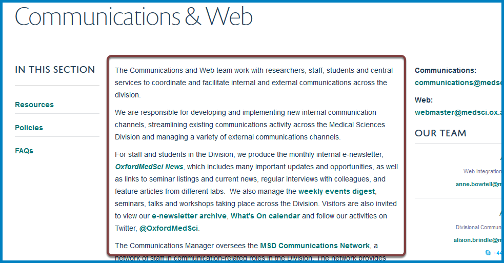
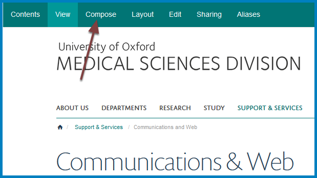
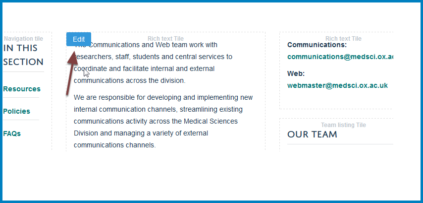
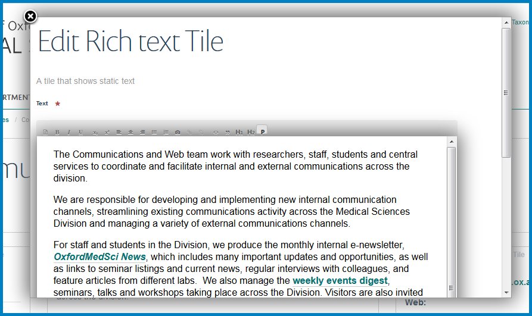
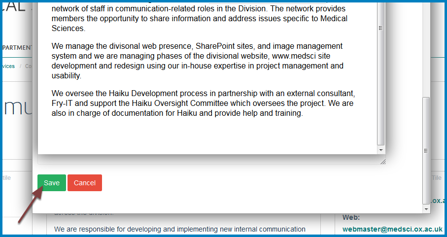

Edit the main Team Description
==============================

This shows you how to edit the main description area of your team page: 

Compose
-------

Go to your team page and click **Compose** at the top of the page. 

Edit the main team description
------------------------------

Move your cursor over the main description area to reveal an **Edit** button. Click the **Edit** button to go to the editing interface. 

Make your changes
-----------------

You will now see the text editing tile. Make your changes. 

Save your changes
-----------------

After you have made your changes scroll to the bottom of the page and click **Save**.

Further information
-------------------

* :doc:`Create an Internal Link <Create_an_Internal_Link>`
* :doc:`Create a Link to an External Website <Create_a_Link_to_an_External_Website>`
* :doc:`Create an Email Link <create-an-email-link>`