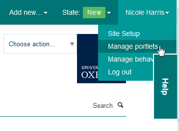
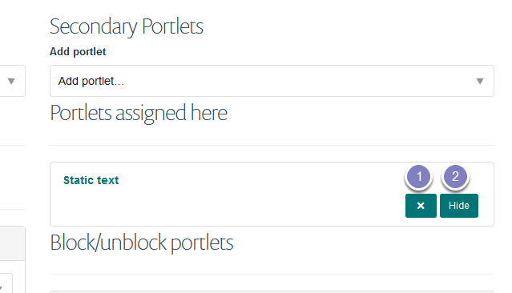
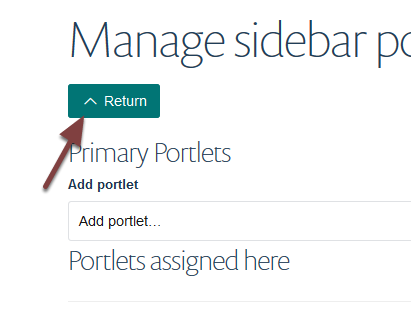

Hide / Delete a Portlet
=======================

This show you how to hide or delete a portlet on the right side of a course page.

Manage portlets
---------------

Click your name in the top right of the screen and select **Manage portlets**.

Delete or hide portlet
----------------------

You can:

#. Delete a portlet by clicking the **x**
#. Hide the portlet by clicking the **Hide** button. Use this option if you are likely to use a portlet on the page in the future. 

Click the **Return** button to go back to your page. 