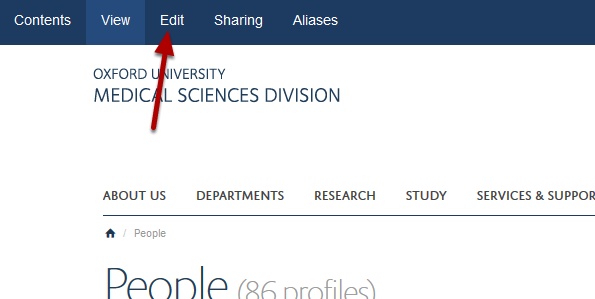
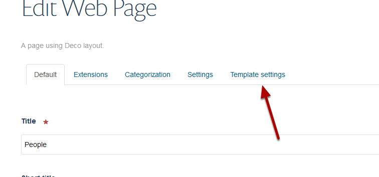
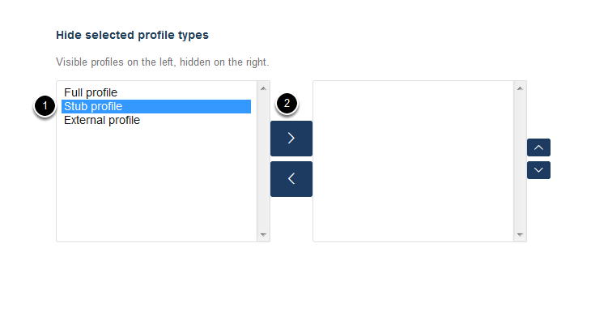

Hide Profiles by Type in the Our Team Section
=============================================

You can prevent types of profiles (stub, external or full) from displaying in the Our Team section. The profiles will be available to add to and display on Research Group pages. 

Edit Team
---------

Go to the Team / People section of your website. 

Click **Edit**. 

Template settings
-----------------

Click on **Template settings**.

Hide selected profile types
---------------------------

Scroll down the page to the **Hide selected profile types** section. The profiles on the left are visible in the Our Team section and profiles on the right are hidden.

To hide profiles:

1. Select profile type to be hidden.

2. Click on the top arrow to move the profile type to the hidden column. 

Save your changes
-----------------

Scroll down to the bottom of the page. 

Click on the **Save **button. 