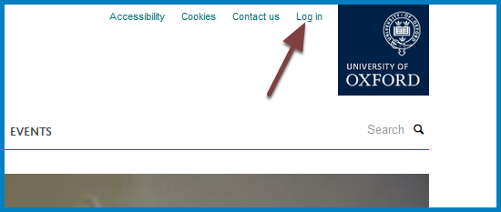
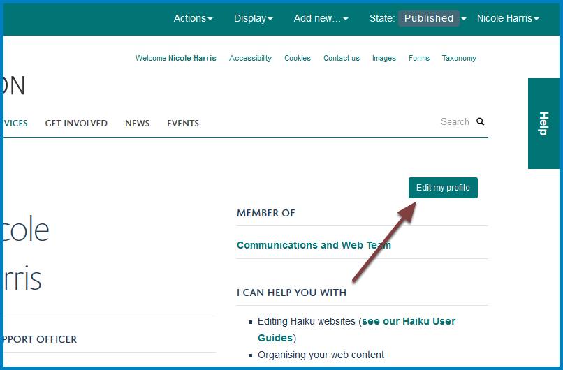
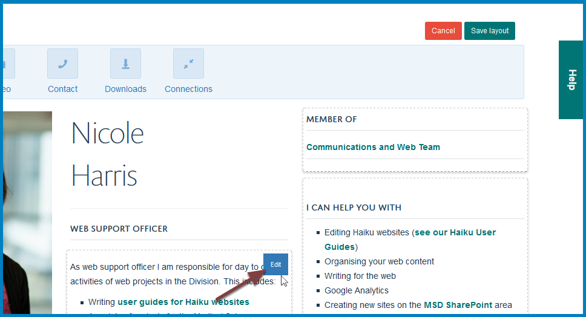
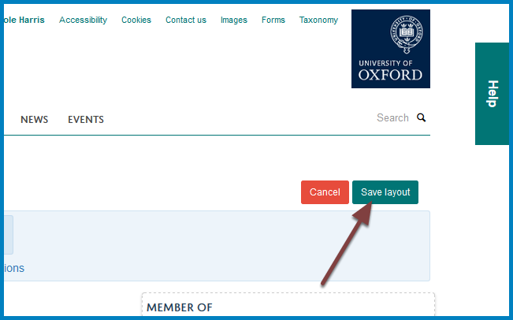

Profiles
========

You can edit your own profile. 

Please refer to the :doc:`Style Guide <msd-style-guide>` before making changes as it is important that profiles are consistent across the site. Changes to the website will be monitored and any profiles not conforming to the style guide will be edited. 

Email webmaster@medsci.ox.ac.uk if you have any problems editing your profile. 

Log in
------

Click the **Log in** link to the left of the University logo and log in with your SSO username and password (same as you use for your email). 

Edit profile
------------

Go to your profile. Click **Edit my Profile**.

* A profile is divided into different tiles (sections). 
* When you hover over a tile you will see an **Edit** button. 
* Click the **Edit** button to open the editing interface for the section and make your changes. 
* See the futher information section below for guides on how to edit specific parts of the your profile. 

Save layout
-----------

Click the **Save layout** button after making your changes. 

Further information
-------------------

* :doc:`MSD Support & Services Style Guide <msd-style-guide>`
* :doc:`Change your Name or Job Title on a Profile <change-your-name-or-job-title-on-a-profile>`
* :doc:`Change / Add Contact Details on your Profile <Change__Add_Contact_Details_on_your_Profile>`
* :doc:`Add a Text Tile to your Profile <add-a-text-tile-to-your-profile>`
* :doc:`Delete a Text Tile from your Profile <Delete_a_Text_Tile_from_your_Profile>`
* :doc:`Add a Connections Tile to your Profile <Add_a_Connections_Tile_to_your_Profile>`
* :doc:`Change the Display Order of Connections on your Profile <Change_the_Display_Order_of_Connections_on_your_Profile>` 
* :doc:`Create an Internal Link <Create_an_Internal_Link>`
* :doc:`Create a Link to an External Website <Create_a_Link_to_an_External_Website>`
* :doc:`Create an Email Link <create-an-email-link>`