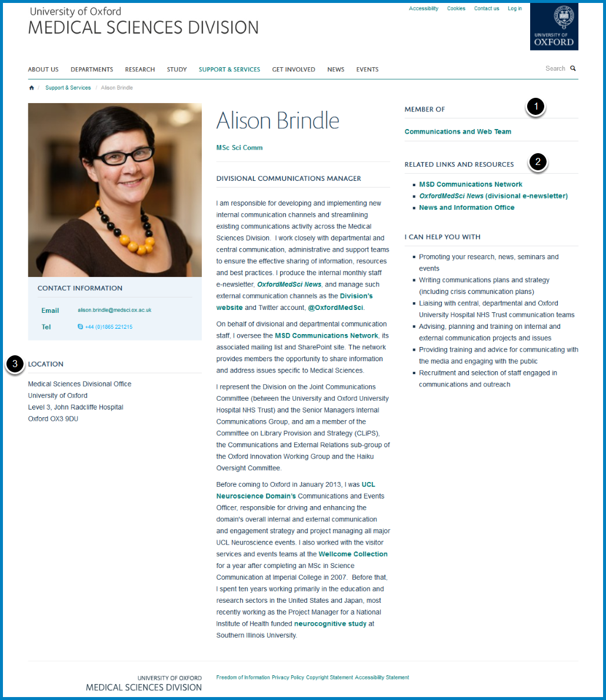

Style guide
===========

For the most part, we have adopted the `University Style Guide <http://www.ox.ac.uk/sites/files/oxford/media_wysiwyg/University%20of%20Oxford%20Style%20Guide.pdf>`_ for the new MSD website - except for instances detailed below.  

It is essential that the website content and design remains consistent, and much of the design and layout is fixed. The Communications and Web Team will monitor the site regularly and any changes made that are inconsistent with our chosen style will be changed. 

Profiles
--------

You do not need to include all these feature boxes (called tiles in Haiku) on your profile page, but if you do include any, they must be added in the position show in screen shot. 

#. **Member of:** Add your team name first, and link it to your team page (unless you are not part of the core divisional office, and it can then link to your own website). You may also add any other university networks, colleges etc. that you are a member of
#. **Related Links and Resources: **Bullet any links you add
#. **Location: **All addresses should be consistent. Please use the same format as one of your colleagues, or one of the following: 

::

     Medical Sciences Divisional Office
     University of Oxford
     Level 3, John Radcliffe Hospital
     Oxford OX3 9DU

::

     Medical Sciences Divisional Office (Education)
     University of Oxford
     The Fleming Suite
     Level 3, John Radcliffe Hospital
     Oxford OX3 9DU

::

     Medical School Office
     University of Oxford 
     Academic Centre
     Level 2, John Radcliffe Hospital
     Oxford OX3 9DU

::

     Medical Sciences Teaching Centre
     South Parks Road
     Oxford OX1 3PL

Voice
-----

* Use first person (I, we)
* Do not use abbreviations, or spell them out the first time, and add abbreviations in brackets for subsequent use
* Do not use technical jargon or Oxford-speak (e.g. Hilary term) 

Capitalisation
--------------

When referring to the Division and the University, and implicitly meaning the Medical Sciences Division or University of Oxford, please capitalise Division and University. Do not capitalise in other instances

Correct use of capitalisation: 

* The Division is the largest division in the University.
* The University has four divisions. I work in the best division, the Medical Sciences Division. The Division is great!
* I work on the divisional website in the divisional office. 
* I work in the Medical Sciences Divisional Office, for the divisional Finance team.

Bullet points
-------------

* Don’t punctuate at the end of each bullet point
* Capitalise each new bullet point

