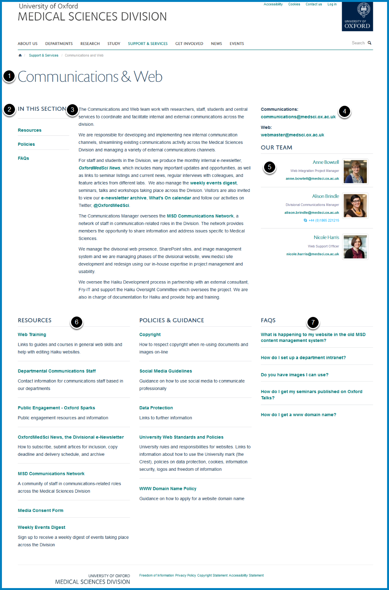

Overview - MSD Team Pages
=========================

The screenshot shows you the different sections of a team page. Please refer to the guides listed below for details on how to edit these sections. 

**1. Team Name** - if you would like to change the team name please email webmaster@medsci.ox.ac.uk

**2. Navigation** - this is automatically generated from the columns (numbers 6 and 7 on screenshot above) 

**3. Main Team Description**

* :doc:`Edit the main team description <edit-the-main-team-description>`

**4. Contact Details**

* :doc:`Edit contact details <edit-contact-details>`

**5. Our Team**

* :doc:`Add a Team Member <add-a-team-member>`
* :doc:`Remove a Team Member <remove-a-team-member>`
* :doc:`Change the Order of Team Members <change-the-order-of-team-members>`

(The Medical School Support & Services team page also uses columns for team members - please see the column section below)

**6. Columns** 

* :doc:`Columns of Further Information <columns-of-further-information>`
* :doc:`Add a New Column <add-a-new-column>`
* :doc:`Change the Title of a Column <change-a-column-title>`

Contents columns:

* :doc:`Edit a Column Page <edit-a-column-page>`
* :doc:`Add a Webpage to a Column <add-a-column-page>`
* :doc:`Add a Link to another Website to a Column <add-a-link-to-a-column>`
* :doc:`Add a Document to a Column <add-a-document-to-a-column>`
* :doc:`Change the Display Order of Webpages, Links and Documents <change-the-display-order-of-webpages--links-or-documents-in-a-column>`
* :doc:`Restrict a Column Page to SSO <restrict-a-column-page-to-sso>`

List of items columns:

* :doc:`Add an Item to a List of Items Column <add-an-item-to-a-list-of-items-column>`
* :doc:`Remove an Item from a List of Items Column <remove-an-item-from-a-list-of-items-column>`

Profile columns (currently used on the Medical School team page):

* :doc:`Remove Profiles from a Column Listing Profiles <remove-profiles-from-a-column-listing-profiles>`
* :doc:`Add a Profile to a Column Listing Profiles <add-a-profile-to-a-column-listing-profiles>`
* :doc:`Change the Order of Profiles in a Column Listing Profiles <change-the-order-of-profiles-in-a-column-listing-profiles>`

**7. FAQs**

* :doc:`Create a FAQs section <create-a-faqs-section>`
* :doc:`Edit a FAQ <edit-a-faq>`
* :doc:`Add a FAQ <add-a-faq>`
* :doc:`Change the Display Order of FAQs <change-the-display-order-of-faqs>`
* :doc:`Set the number of FAQs on display on your team page <set-the-number-of-faqs-on-display-on-your-team-page>`

 