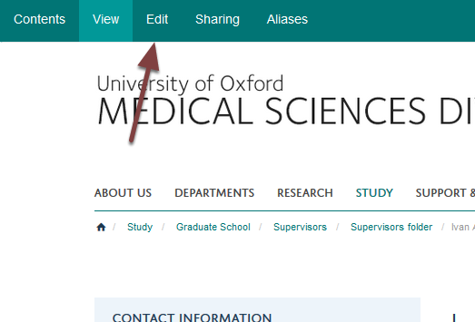
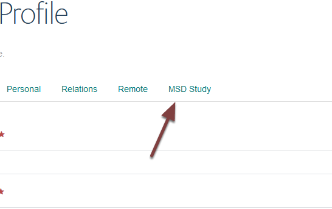
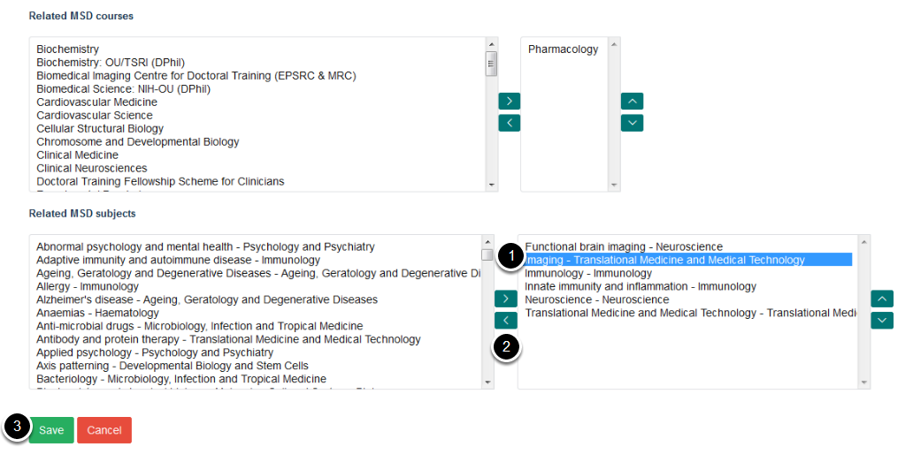

Remove a Course and/or Subject Area to a Supervisor
===================================================

Courses and subject areas are allocated to a supervisor from their profile page. This shows you how to remove these. 

Edit supervisor's profile
-------------------------

Go the supervisor's profile. To edit:

#. Local profiles (profiles set up on the MSD website) click on **Edit** on the toolbar at the top of the page.
#. Remote profiles (which have been pulled in from another Haiku website) type /edit at the end of the web address: eg `https://www.medsci.ox.ac.uk/study/graduateschool/supervisors/supervisors-folder/ivan-ahel <https://www.medsci.ox.ac.uk/study/graduateschool/supervisors/supervisors-folder/ivan-ahel>`_ becomes: `https://www.medsci.ox.ac.uk/study/graduateschool/supervisors/supervisors-folder/ivan-ahel/edit <https://www.medsci.ox.ac.uk/study/graduateschool/supervisors/supervisors-folder/ivan-ahel>`_

MSD Study
---------

Click **MSD Study**.

The lists on the left of the screen show all the MSD courses and subject areas. The lists on the right lists all the courses and subject areas which have been allocated to the supervisor. 

To remove a course or subject area:

#. Highlight the course or subject area.
#. Click the bottom arrow.
#. Click the **Save** button. 