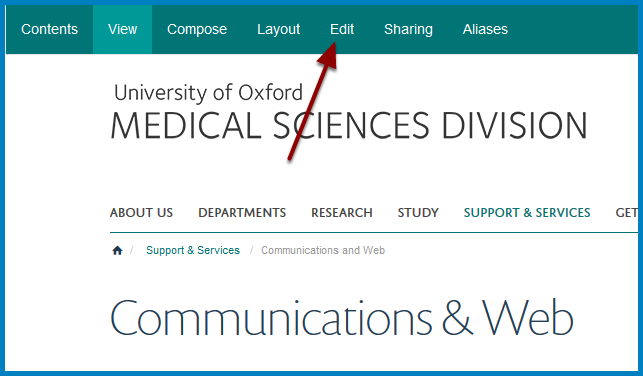
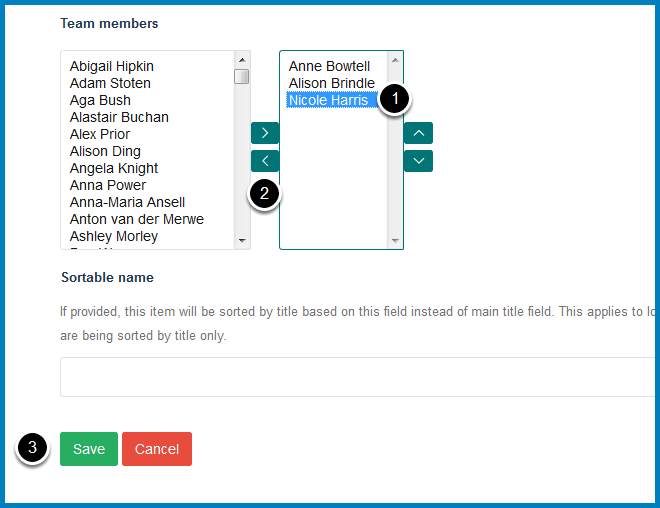

Remove a Team Member
====================

This shows you how to remove people from the **Our Team** section of your team page.

Edit team page
--------------

Go to your team page and click **Edit** at the top of the page.

Remove team member
------------------

Scroll down the page to the **Team members** section.

The column on the left lists all people who are not currently listed as members of your team and the column on the right people who are. 

To remove a team member:

#. Select the person in the right column.
#. Click the bottom arrow.
#. Click **Save**.

Further Information
-------------------

* :doc:`Add a Team Member <add-a-team-member>`
* :doc:`Change the Order of Team Members <change-the-order-of-team-members>`

If you are listing Profiles in a Column please see: 

* :doc:`Remove Profiles from a Column Listing Profiles <remove-profiles-from-a-column-listing-profiles>`
* :doc:`Add a Profile to a Column Listing Profiles <add-a-profile-to-a-column-listing-profiles>`
* :doc:`Change the Order of Profiles in a Column Listing Profiles <change-the-order-of-profiles-in-a-column-listing-profiles>`