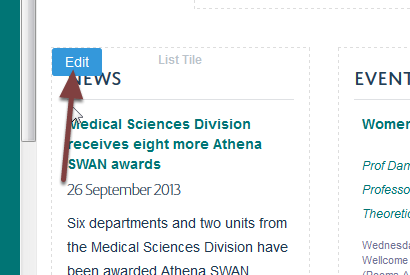
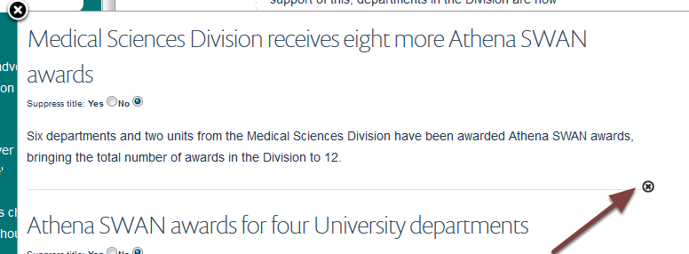

Remove an Item from a List of Items Column
==========================================

.. note:: These user guides are being phased out and replaced with the guides on `Haiku Knowledge Base <https://fry-it.atlassian.net/wiki/display/HKB/Haiku+Knowledge+Base>`_

A list of items columns enables you to add items from other parts of the website to your team page. This shows you how to remove an item from your team page. 

Compose
-------

Go to your team page and click **Compose** on the toolbar at the top of the screen. 

Edit column
-----------

Move your cursor over your list of items column to reveal the **Edit** button. Click the **Edit** button to go to the editing interface. 

Remove item
-----------

Scroll down the editing interface to reach the item you would like to remove. Click on the cross on the bottom right of the item. 

Save
----

Click the **Save** button at the bottom of the editing interface. 