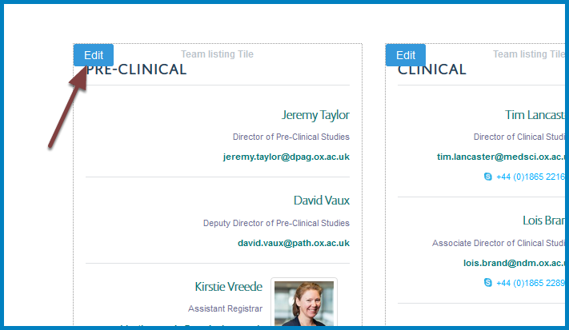
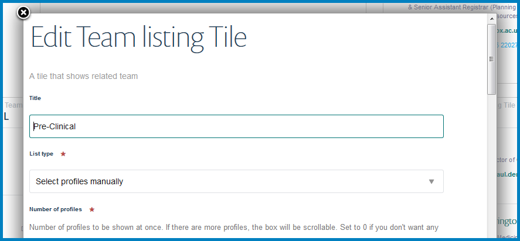
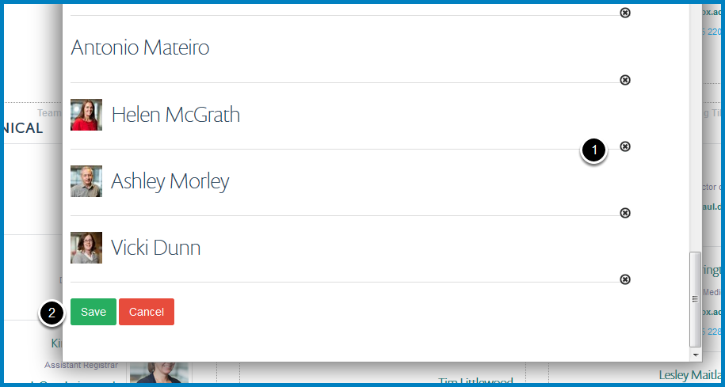

Remove Profiles from a Column Listing Profiles
==============================================

You can have a column listing profiles. This shows you how to remove profiles.

If you would like to create a new column listing profiles please email webmaster@medsci.ox.ac.uk

Compose
-------

.. image:: images/remove-profiles-from-a-column-listing-profiles/compose.png
   :alt: 
   :height: 326px
   :width: 611px
   :align: center

Click on **Compose** on the toolbar at the top of the page. 

Edit 
-----

Click the **Edit** button in the top left corner of the column you would like make changes to. This will bring up the editing interface:

Scroll down the editing interface until you reach the names of the people listed in the column.

#. Click the cross to the bottom right of the person you would like to remove.
#. Click the **Save** button. 

Further information
-------------------

* :doc:`Add a Profile to a Column Listing Profiles <add-a-profile-to-a-column-listing-profiles>`
* :doc:`Change the Order of Profiles in a Column Listing Profiles <change-the-order-of-profiles-in-a-profiles-listing-column>` 
* :doc:`Change the Title of a Column <change-a-column-title>`