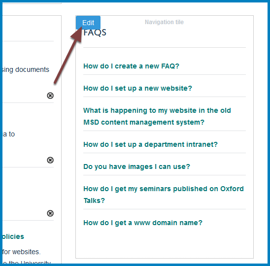
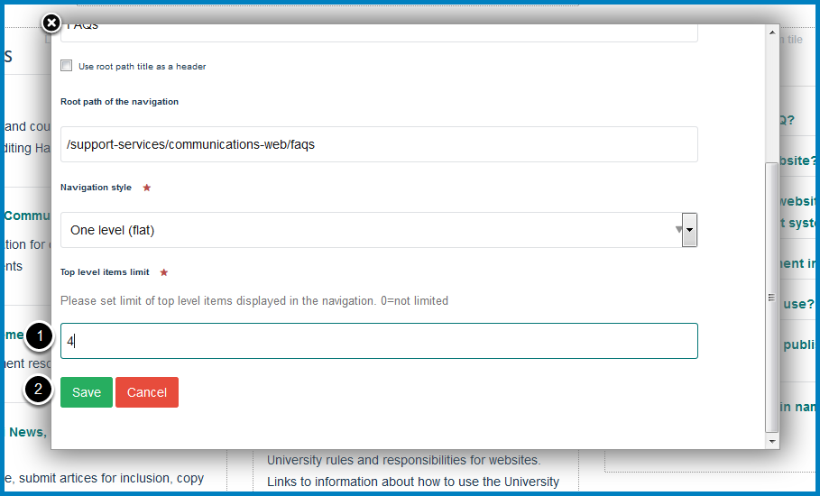
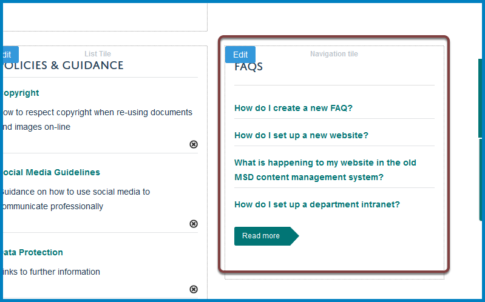

Set the Number of FAQs on Display on your Team Page
===================================================

By default all your FAQs will display on your team page. If you have a long list you might want to limit the number showing on your team page with a link to the complete list. 

Compose
-------

Click **Compose** on the toolbar at the top of the page. 

Edit FAQs
---------

Click **Edit** in the top left of the FAQs tile to bring up the editing interface. 

Set number of FAQs to display
-----------------------------

Scroll to the **Top level items limit** box

#. Enter the number of FAQs you would like displayed on your team page (if you would like to display all FAQs enter 0).
#. Click the **Save** button.

Team page
---------

On your team page you will now see the number of FAQs specified in the previous step along with a link to a list of all your FAQs. 

Exit compose
------------

To exit the Compose interface click **View** at the top of the screen. 

Further Information
-------------------

* :doc:`Create a FAQs section <create-a-faqs-section>`
* :doc:`Edit a FAQ <edit-a-faq>`
* :doc:`Add a FAQ <add-a-faq>`
* :doc:`Change the Display Order of FAQs <change-the-display-order-of-faqs>`