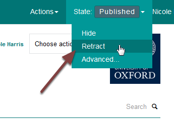
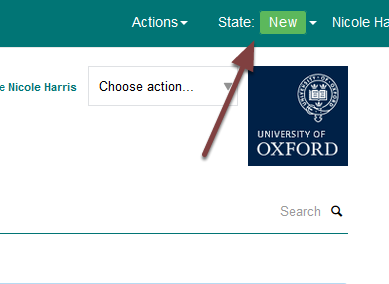

Unpublish a course (MSD Graduate School)
========================================

This shows you how to unpublish a course page so that it isn't visible to visitors to the website. You can also delete a course. 

Retract page
------------

Go to the course page you would like to unpublish. Click the **Publish** button on the toolbar at the top of the page and select **Retract**. 

Unpublished page
----------------

You will see that the page **State** has changed to **New**. 

Further information
-------------------

* :doc:`Delete a course <delete-a-course>` (MSD Graduate School)