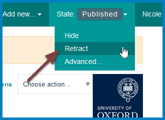
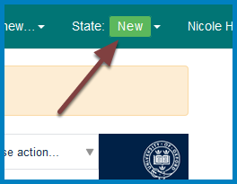

Unpublish a News Item
=====================

This shows you how to unpublish a news item. 

Go to the news item you would like to unpublish. Click **State** in the toolbar at the top of the screen and select **Retract**. 

**Note: **Hide doesn't unpublish an item - anyone with a University SSO login will be able to login and see the page. 

The news item now has a **State** of **New**. 