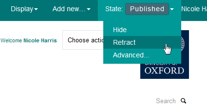
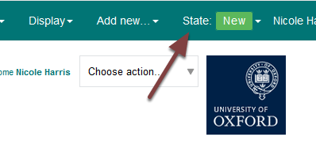

Unpublish a Supervisor (MSD Graduate School)
============================================

You can unpublish a supervisor so that users to the site won't be able to see the supervisor. You also have the option to delete a supervisor. 

Retract profile
---------------

Go to the supervisor profile you would like to unpublish. 

Click the **Published** button on the toolbar at the top of the screen and select **Retract** from the drop down list. 

You will now see that the profile state has changed to: **New**.

Further information
-------------------

:doc:`Delete a Supervisor <delete-a-supervisor>` (MSD Graduate School)