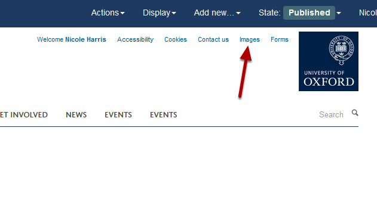
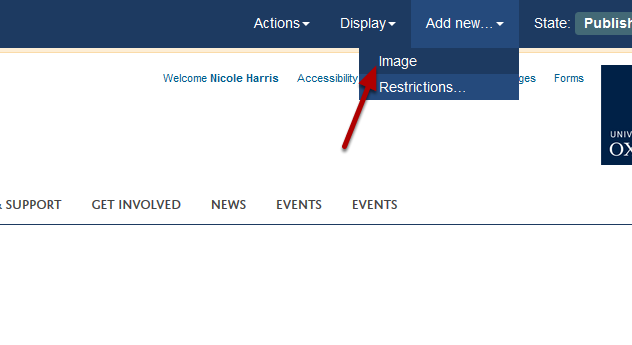
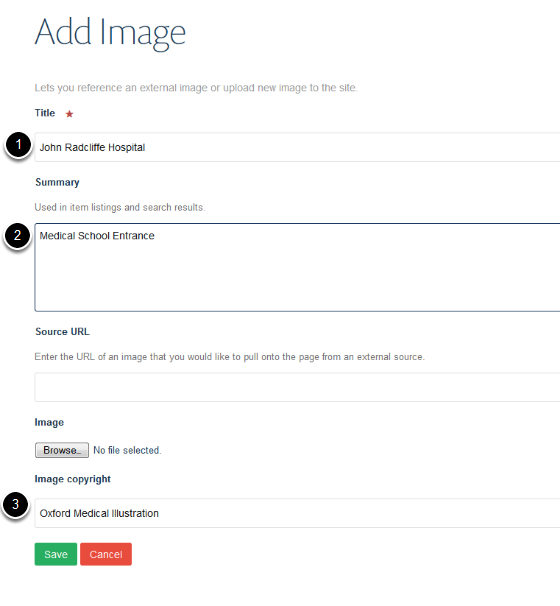
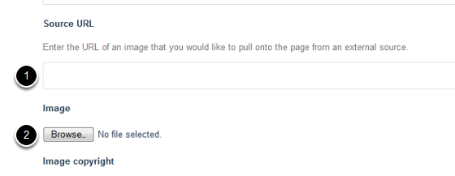
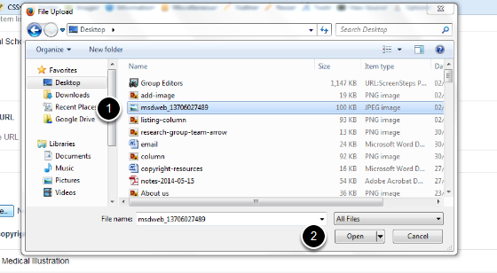
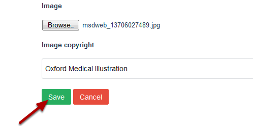

Upload an Image to the Image Library
====================================

This show you how to add an image to the Image Library. 

Images
------

Click on **Images **on the top right of the page. 

Select folder
-------------

Click on the name of folder you would like to add the image to.

Add image
---------

Click on the **Add new...** drop down menu from the toolbar at the top of the screen. 

Select **Image**.

Image details
-------------

Enter information about your image:

#. Title
#. A description of the image (optional)
#. Copyright information.

Upload image
------------

To upload the image either:

1. Enter the web address of the image if the image has been published to the web 

Or

2. Click on **Browse ...** to upload the image from your computer.

Uploading image from your computer
----------------------------------

#. Select the image
#. Click **Open**. 

Save the image
--------------

Click **Save**.